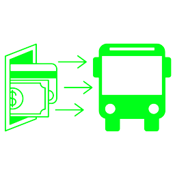

<div align="center">




<h1>SUBE CRYPTO</h1>

A public transport system payment

</div>

---

Inspired by the Argentine public transport payment system, this project aims to solve an ongoing issue in the system, which is the slow loading of physical data (which still exists in Argentina today), as well as allowing for decentralized payment, without the need for payment distributors, which are often far from users living outside of major cities.

The program is designed to scale nationally for any nation willing to accept blockchain technology in its public transport system, so if necessary, a function could be created to attach specific user data, but as a demo, it was not considered necessary. This comment also applies to price modifications by bus lines or specific transportation providers.

The program logic allows for the creation of decentralized bus lines (although it could be focused on any other public/private transportation), incentivizing the widespread adoption of new travel lines around the city. On the user side, the means of payment is a specific key pair that anyone can create and credit without the need to go to an official provider, which charges fees for loading. So every time a trip is taken, it is recorded on the Solana blockchain.

Like any blockchain technology, it is not yet in the bidding or practical application process due to regional legislation, but this project aims to establish the foundations of what could be a decentralized and simplified transport system in favor of the consumer and not in favor of the monopolistic bus lines regulated by law.

<h3 align="center">Initialize a bus line</h3>

```rust
// This function initializes a bus line with different prices for different distances.
pub fn initialize_bus_line(
    ctx: Context<InitializeBusLine>, // A context struct that holds accounts and other contextual information.
    to3km: u64, // Price for a distance of up to 3 km.
    to6km: u64, // Price for a distance between 3 km and 6 km.
    to12km: u64, // Price for a distance between 6 km and 12 km.
    to27km: u64, // Price for a distance between 12 km and 27 km.
    more27km: u64, // Price for a distance greater than 27 km.
) -> Result<()> {
    // Generate a program-derived address (PDA) from the signer's key and program ID.
    let (_services_pda, bump): (Pubkey, u8) =
        Pubkey::find_program_address(&[
            ctx.accounts.signer.key().as_ref()
            ],
            ctx.program_id
        );
    // Get a mutable reference to the SubeAdminAccount associated with the Sube PDA.
    let sube: &mut Account<SubeAdminAccount> = &mut ctx.accounts.sube;
    // Set the authority of the SubeAdminAccount to the signer's key.
    sube.authority = ctx.accounts.signer.key();
    // Set the original bump value of the SubeAdminAccount to the generated bump.
    sube.bump_original = bump;
    // Set the prices of the SubeAdminAccount to the provided prices.
    sube.prices = [
        to3km,
        to6km,
        to12km,
        to27km,
        more27km
    ].to_vec();
    // Return a successful result.
    Ok(())
}

// This struct defines the accounts required for the initialize_bus_line function.
#[derive(Accounts)]
pub struct InitializeBusLine<'info> {
    // The SubeAdminAccount to be initialized.
    #[account(
        init,
        seeds = [signer.key().as_ref()], // Seeds used to generate the PDA.
        bump, // Bump value used to generate the PDA.
        payer = signer, // The account that pays for the creation of the SubeAdminAccount.
        space = 8 + SubeAdminAccount::SIZE // Required space for the SubeAdminAccount.
    )]
    pub sube: Account<'info, SubeAdminAccount>,
    // The signer account that authorizes the transaction.
    #[account(mut)]
    pub signer: Signer<'info>,
    // The system program account.
    pub system_program: Program<'info, System>,
}
```

This function called initialize_bus_line, is used to initialize a bus line and set the prices to be charged for different travel legs.

It takes as arguments a Context<InitializeBusLine> structure that contains relevant contextual information, as well as the prices to set for different travel legs. The prices are passed as parameters to the function and are assigned to an array of prices in the SubeAdminAccount that is created or initialized in the function.

The first step of the function is to use the provided signer's public key to calculate a derived public key and a "bump" (an offset value used to protect against key collision attacks). The derived public key is used to seed a SubeAdminAccount, which is set as a seed account. The space argument is used to set the storage space required for the account.

After the account is initialized, the signatory is set as the account authority and the original "bump" is set. The prices are assigned to a price array in the SubeAdminAccount that was just initialized.

Finally, the function returns an empty result value Ok(()). The Accounts structure is used to specify the relevant accounts that are used in the function and passed as arguments. In this case, the upload account and the signatory signer, as well as the system program, are specified.

<h3 align="center">Take a trip</h3>

```rust
pub fn take_a_trip(
    ctx: Context<TakeATrip>,
    km: u8
) -> Result<()> {
    require!(km <= 4, ErrorCode::InvalidaKilometer);
    require!(ctx.accounts.sube.key() == ctx.accounts.to.key(), ErrorCode::PubkeyError);
    let amount: u64 = ctx.accounts.sube.prices[km as usize];
    let transfer =
        system_instruction::transfer(
            &ctx.accounts.from.key(),
            &ctx.accounts.to.key(),
            amount
        );
    program::invoke(
            &transfer,
            &[
                ctx.accounts.from.to_account_info(),
                ctx.accounts.to.to_account_info().clone(),
            ],
        )
        .expect("Error");
        msg!("Paid bus ticket");
    Ok(())
}

#[derive(Accounts)]
pub struct TakeATrip<'info> {
    #[account(
        mut,
        seeds = [sube.authority.key().as_ref()],
        bump = sube.bump_original
    )]
    pub sube: Account<'info, SubeAdminAccount>,
    /// CHECK: This is not dangerous
    #[account(mut, signer)]
    pub from: AccountInfo<'info>,
    /// CHECK: This is not dangerous
    #[account(mut)]
    pub to: AccountInfo<'info>,
    pub system_program: Program<'info, System>,
}
```

The first argument is a ctx context object, which contains information about the current transaction. ctx is also expected to have a TakeATrip structure that defines the accounts involved in the transaction.

The second argument is the number of kilometers the user wishes to travel on the bus.

It is verified that the number of kilometers is valid and that the sender of the transaction and the receiver of the transaction are the same accounts that are defined in the TakeATrip structure. The sube account is accessed and the amount of money that must be paid for the ticket is obtained, according to the distance that the user wishes to travel.

An instruction is created to transfer the cryptocurrency or token from the sending account to the receiving account, with the previously calculated amount of money. The function program::invoke is called to execute the transfer statement.

If the transfer was successful, an Ok(()) value is returned, otherwise an error is raised.
